# 来跑圈 - 跑团管理系统

一款专为跑步爱好者和跑团组织者设计的综合管理平台，涵盖活动组织、赛事计时、数据追踪、AI 教练等核心功能。

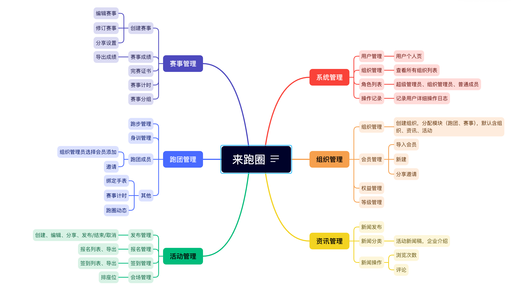

---

## 功能概览

 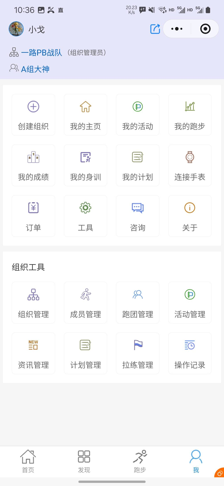

### 组织管理

 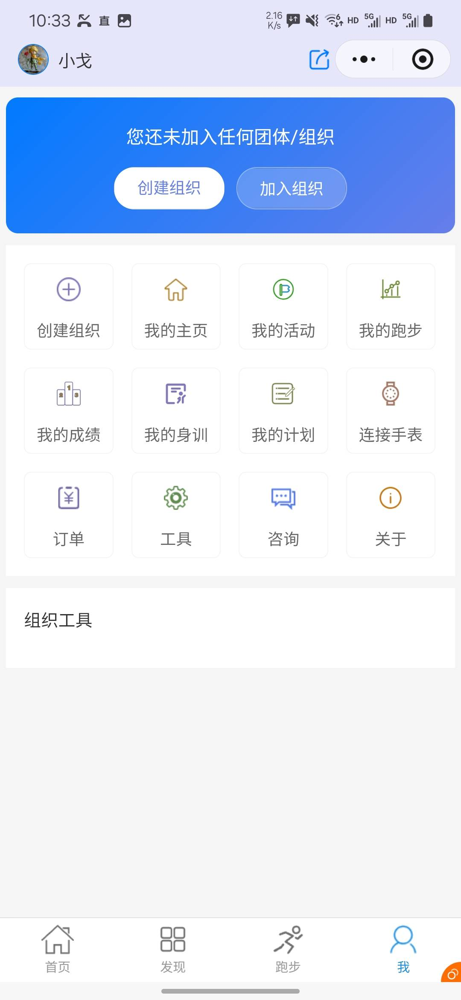

- 多层级组织体系
- 组织成员管理与权益配置
- 等级制度设定
- 组织加入申请与审批

### 跑团管理

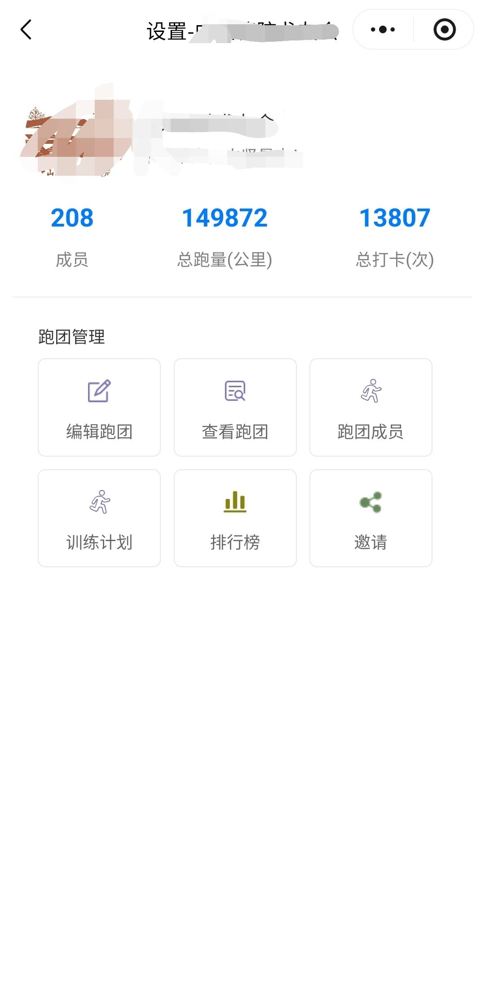 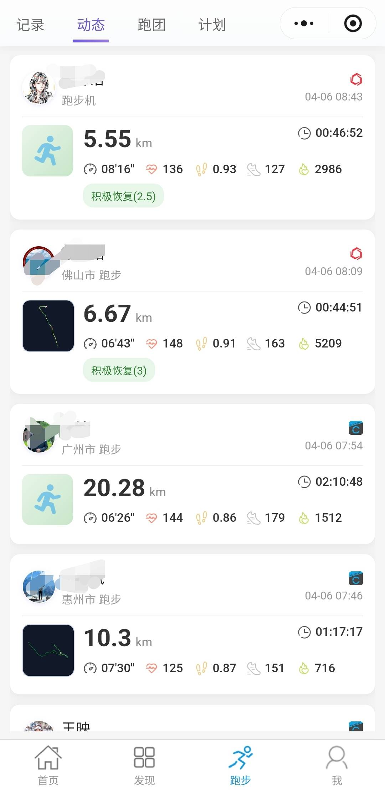
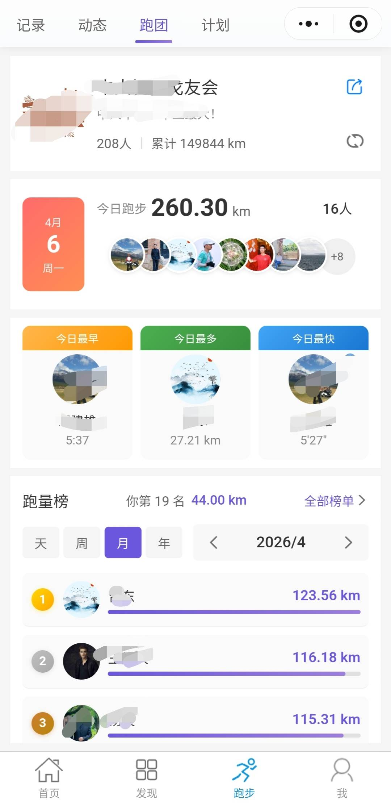

- 跑团创建与信息维护
- 成员加入申请与审批流程
- 跑团排行榜与数据统计
- 团队活动关联管理

### 智能手表集成

- 支持 **Garmin**（佳明）手表数据自动同步
- 支持 **Coros**（高驰）手表数据自动同步
- 跑步数据自动拉取：距离、配速、心率、轨迹
- 分圈数据与心率区间分析
- GPS 轨迹回放与图片生成

### 活动管理

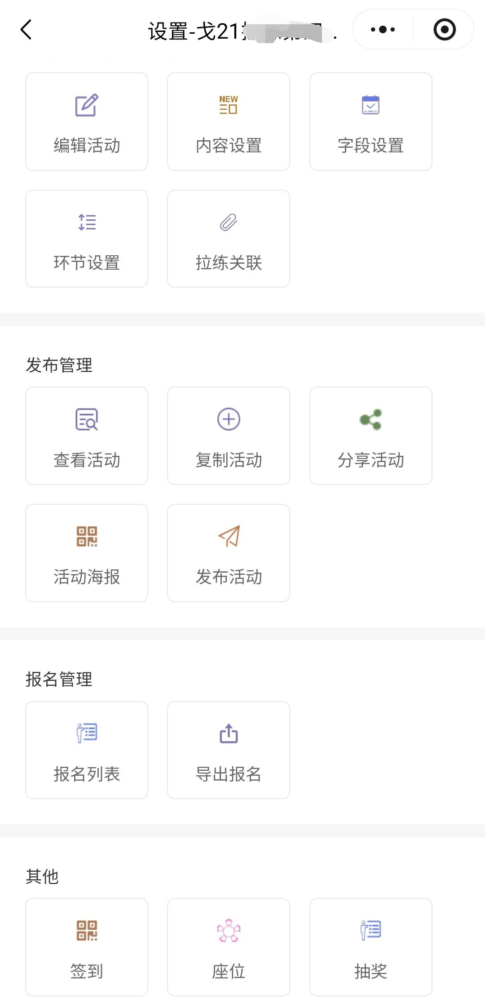

- 创建和发布跑步活动，支持富文本描述和图片展示
- 自定义报名表单，收集参与者信息
- 在线报名与审核管理
- 二维码签到，支持多环节签到
- 座位分配与查询
- 参与者数据导出（Excel）

### 赛事计时

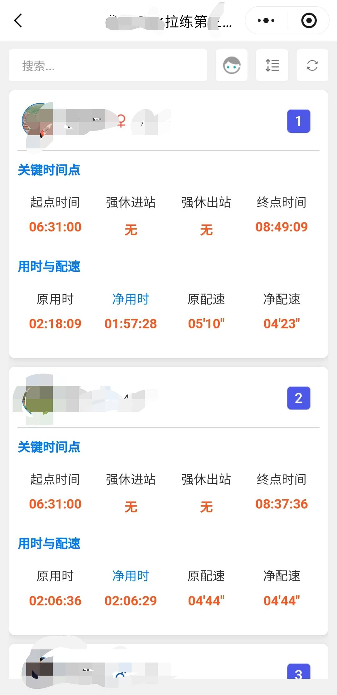 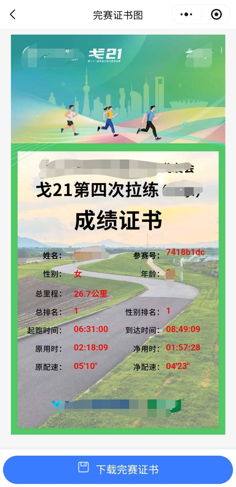

- 个人赛与团队赛管理
- 多打卡点计时：起点、休息站（进/出）、终点
- 实时打卡（二维码扫描 / 手动录入）
- 自动成绩计算（配速、总时长）
- 成绩修正与导出
- 完赛证书生成与分享

### 个人跑步数据

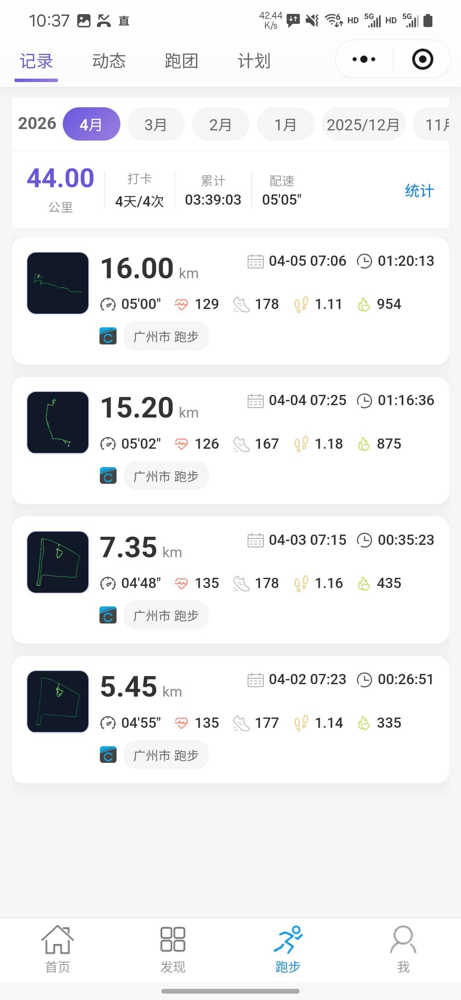 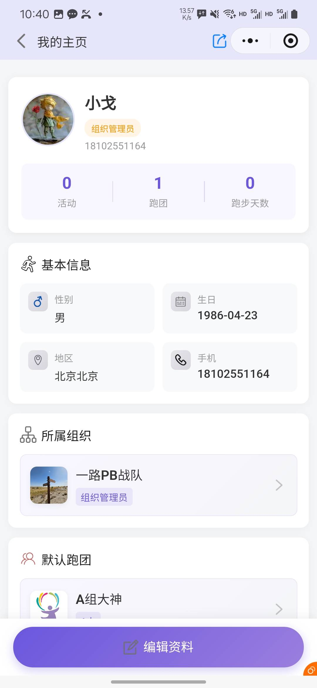
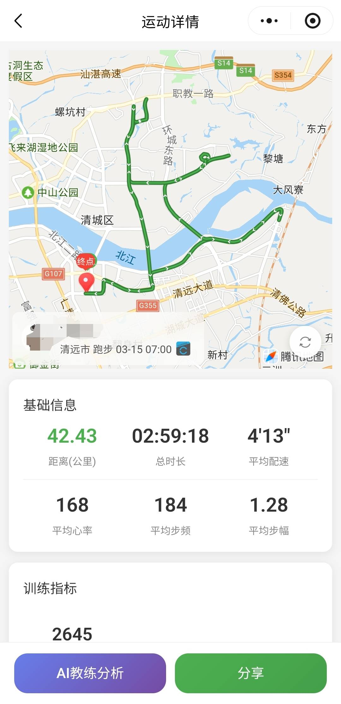

- 跑步记录汇总与历史查询
- 个人统计（总里程、累计时长、平均配速等）
- 跑者排行榜（个人 / 团队维度）
- 跑步数据分享海报

### AI 教练

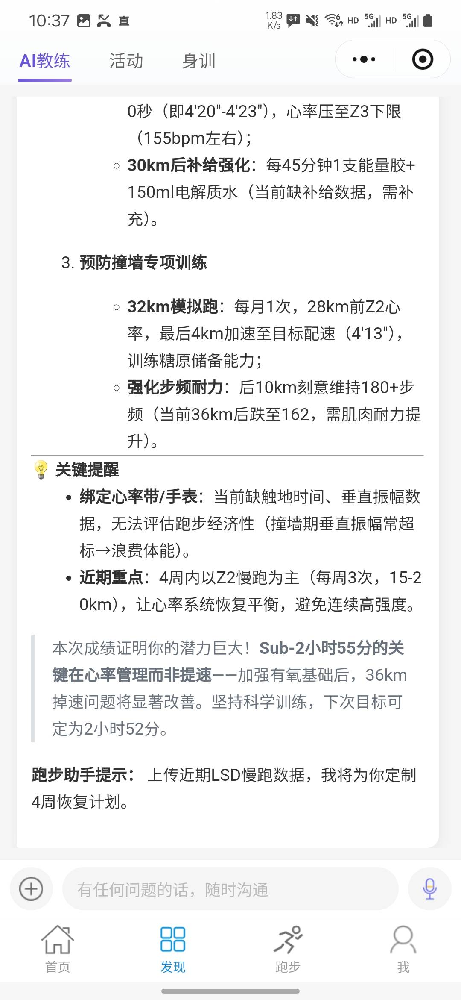

- 智能对话教练，支持多轮上下文
- 文本、图像、语音多模态交互
- 训练建议与运动分析
- 流式响应，体验流畅

### 训练计划

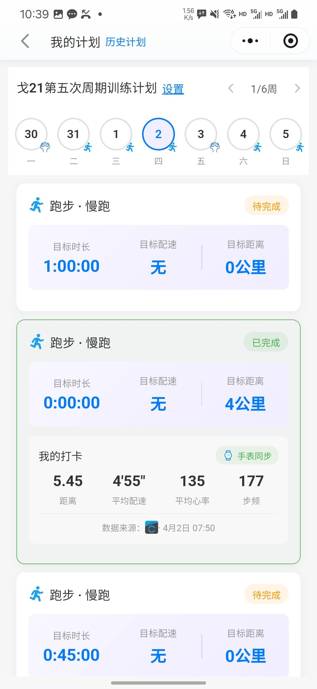 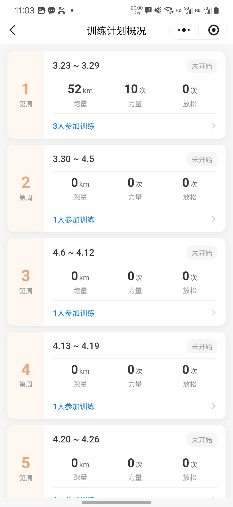

- 结构化训练计划制定
- 每日打卡记录（支持完训照片上传）
- 训练日志与周数据总结
- 力量核心训练、放松滚轴打卡

### 课程管理

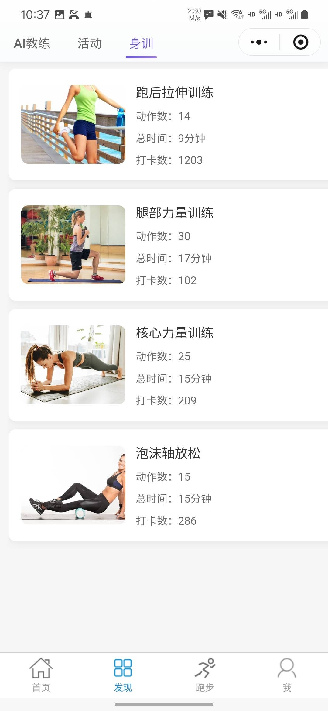

- 训练课程发布（支持视频）
- 课程记录与完成追踪
- 点赞与互动

### 抽奖系统

- 灵活配置抽奖规则
- 实时抽奖与中奖展示
- 抽奖大屏（WebSocket 实时推送，3D 滚动动画效果）

### 信息发布

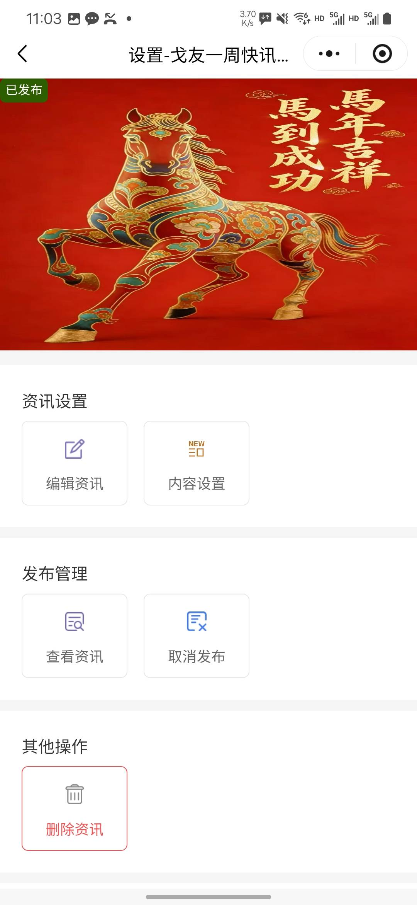

- 公告与新闻发布
- 首页轮播图配置
- 富文本内容编辑

---

## 使用方式

### 第一步：搜索小程序

打开微信，在搜索框中搜索 **"来跑圈"**，找到并进入小程序。

### 第二步：注册账号

首次使用需注册账号，支持微信一键授权登录。

### 第三步：注册组织

1. 进入小程序后，点击 **"组织"** 入口
2. 选择 **"创建组织"**，填写组织名称、简介等基本信息
3. 提交后等待审核（或即时生效，视配置而定）
4. 审核通过后即可管理组织成员与权益

### 第四步：创建跑团

1. 在组织内，点击 **"跑团"** 模块
2. 选择 **"创建跑团"**，填写跑团名称、简介、封面等信息
3. 设置加入方式（自由加入 / 审批加入）
4. 邀请成员通过搜索或二维码加入跑团

### 第五步：开始使用

- 发布跑步活动，邀请成员报名参与
- 组织赛事计时，生成完赛证书
- 连接智能手表，自动同步跑步数据
- 使用 AI 教练获取个性化训练建议

---

## 平台支持

| 端 | 说明 |
|---|---|
| 微信小程序 | 主要用户端，支持 iOS / Android |
| 管理后台 | 基于小程序的管理员功能 |
| Web 展示页 | 抽奖大屏、Garmin 授权引导页 |

> 微信小程序名称：**来跑圈**

---

## 联系方式

如有问题或合作意向，欢迎通过以下方式联系：

- **官网**：https://ctrun.argofly.com/
- **邮箱**：kason@argofly.com
- **微信**：扫描下方二维码添加联系

---

> Copyright © 2024-2026 来跑圈. All rights reserved.
